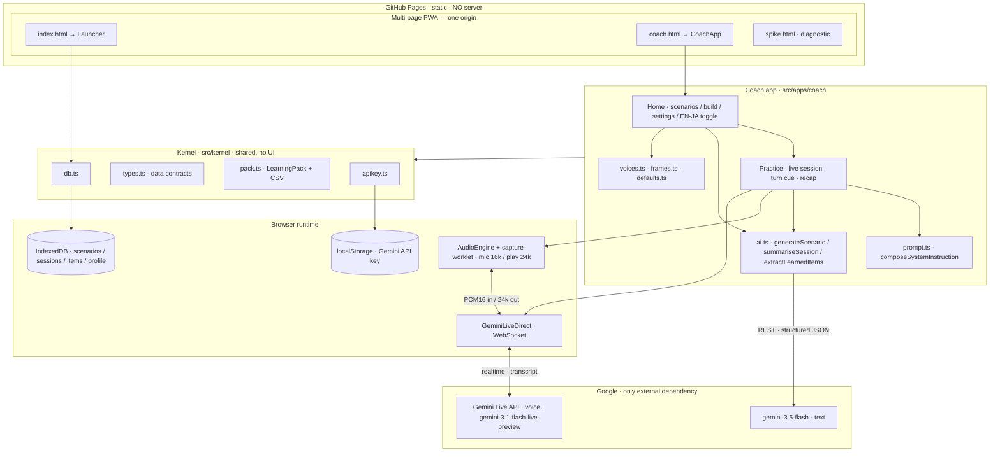
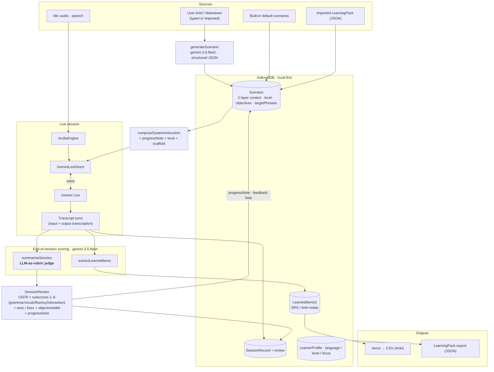

# Architecture

Two views: **(1) system architecture** (what runs where) and **(2) data pipeline**
(where data comes from, and how it is scored). Everything is pure-browser — the
only external dependency is Google's Gemini API.

## 1) System architecture

**Notes** — no backend, no auth server: the key lives in `localStorage` and the
browser talks straight to Gemini. All learner data is local (`IndexedDB`),
portable via a `LearningPack` JSON file. Tools share one origin so they share the
same kernel/DB.

## 2) Data pipeline (sources → scoring → storage → feedback)

### Scoring mechanism (the "judge")
At session end, the stored transcript is sent **once** to `gemini-3.5-flash` as an
**LLM-as-rubric judge** (`summariseSession`):

- **CEFR** — an honest overall estimate of *this* conversation.
- **Per-skill subscores** — integers **1–6 (A1…C2)** for grammar / vocab /
  fluency / interaction (numeric so a running level estimate can be derived).
- **objectivesMet** — each of the scenario's own objectives graded met/not from
  the learner's actual speech.
- **wins / fixes** — what went well, and the top items to fix *with the natural
  correction*.
- **progressNote** — concrete points to target next time; **fed back** into the
  next session's prompt (the feedback loop above), so coaching compounds.

A second cheap call (`extractLearnedItems`) turns the transcript into
`LearnedItem`s (vocab/phrase/grammar), the interop unit other tools/export consume.

> Honest scope: speaking-CEFR from a transcript is an *estimate*, treated as
> holistic guidance, not a calibrated grade. No server-side acoustic scoring.
> Planned hardening (see ROADMAP.md): self-consistency (median of samples),
> per-skill EWMA level state, and a deterministic lexical second opinion.
