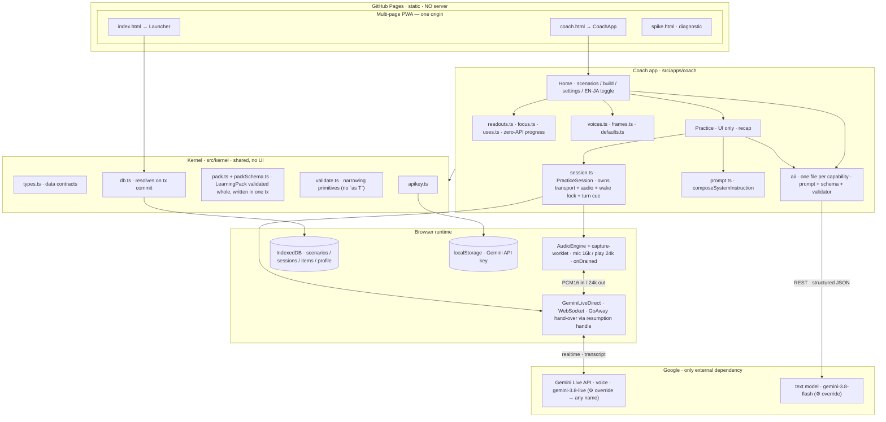
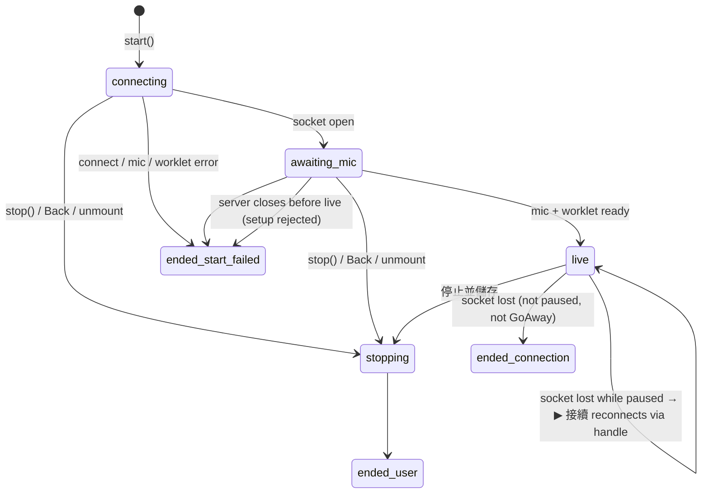
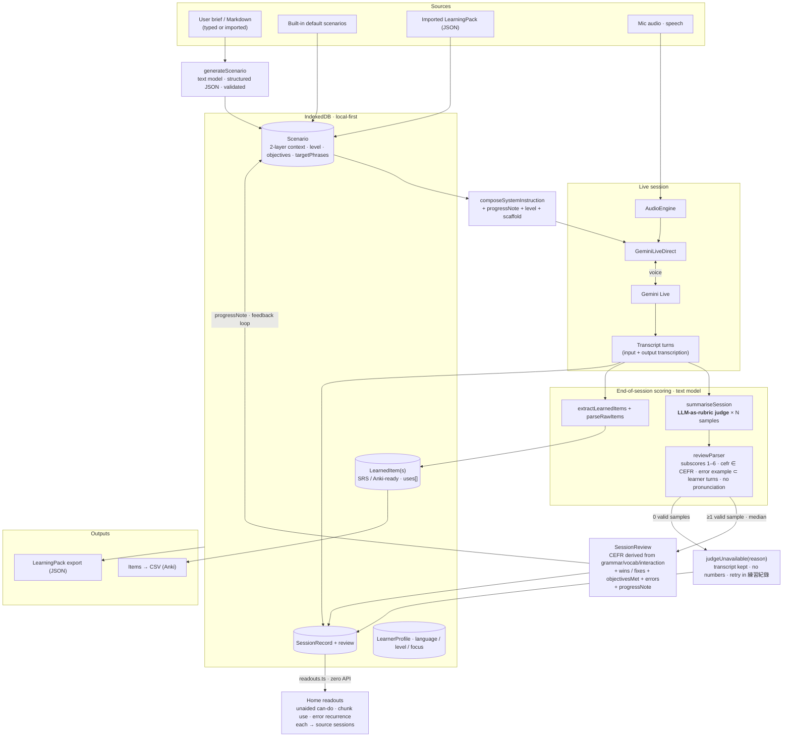

# Architecture

Two views: **(1) system architecture** (what runs where) and **(2) data pipeline**
(where data comes from, and how it is scored). Everything is pure-browser — the
only external dependency is Google's Gemini API.

## 1) System architecture

```mermaid
flowchart TB
  subgraph Host["GitHub Pages · static · NO server"]
    subgraph Pages["Multi-page PWA — one origin"]
      L["index.html → Launcher"]
      C["coach.html → CoachApp"]
      Sp["spike.html · diagnostic"]
    end
  end

  subgraph Coach["Coach app · src/apps/coach"]
    Home["Home · scenarios / build / settings / EN-JA toggle"]
    Practice["Practice · UI only · recap"]
    Session["session.ts · PracticeSession · owns transport + audio + wake lock + turn cue"]
    Prompt["prompt.ts · composeSystemInstruction"]
    AI["ai/ · one file per capability · prompt + schema + validator"]
    Readouts["readouts.ts · focus.ts · uses.ts · zero-API progress"]
    Content["voices.ts · frames.ts · defaults.ts"]
  end

  subgraph Kernel["Kernel · src/kernel · shared, no UI"]
    Types["types.ts · data contracts"]
    DB["db.ts · resolves on tx commit"]
    Pack["pack.ts + packSchema.ts · LearningPack validated whole, written in one tx"]
    Validate["validate.ts · narrowing primitives (no `as T`)"]
    Key["apikey.ts"]
  end

  subgraph Runtime["Browser runtime"]
    Audio["AudioEngine + capture-worklet · mic 16k / play 24k · onDrained"]
    Direct["GeminiLiveDirect · WebSocket · GoAway hand-over via resumption handle"]
    IDB[("IndexedDB · scenarios / sessions / items / profile")]
    LS[("localStorage · Gemini API key")]
  end

  subgraph Ext["Google · only external dependency"]
    Live["Gemini Live API · voice · gemini-3.8-live (⚙️ override → any name)"]
    Flash["text model · gemini-3.8-flash (⚙️ override)"]
  end

  C --> Home --> Practice
  Practice --> Prompt & AI & Session
  Session --> Audio & Direct
  Home --> AI & Content & Readouts
  Coach --> Kernel
  DB --> IDB
  Key --> LS
  Audio <-->|"PCM16 in / 24k out"| Direct
  Direct <-->|"realtime · transcript"| Live
  AI -->|"REST · structured JSON"| Flash
  L --> DB
```

**Notes** — no backend, no auth server: the key lives in `localStorage` and the
browser talks straight to Gemini. All learner data is local (`IndexedDB`),
portable via a `LearningPack` JSON file. Tools share one origin so they share the
same kernel/DB.

### Live session lifecycle (`src/apps/coach/session.ts`)

```mermaid
stateDiagram-v2
  [*] --> connecting: start()
  connecting --> awaiting_mic: socket open
  awaiting_mic --> live: mic + worklet ready
  live --> live: GoAway → resumed socket (reconnecting flag)
  live --> live: pause / resume
  connecting --> stopping: stop() / Back / unmount
  awaiting_mic --> stopping: stop() / Back / unmount
  live --> stopping: 停止並儲存
  stopping --> ended_user
  connecting --> ended_start_failed: connect / mic / worklet error
  awaiting_mic --> ended_start_failed
  live --> ended_connection: socket lost (not paused, not GoAway)
  live --> live: socket lost while paused → ▶ 接續 reconnects via handle
  awaiting_mic --> ended_start_failed: server closes before live (setup rejected)
```

- **One owner, one generation counter.** `PracticeSession` holds the transport,
  the `AudioEngine` and the wake lock. `start()` is three awaits (connect, mic,
  worklet); each re-checks the generation it began under, so a Stop landing
  between two awaits releases the resource that arrives late instead of storing
  it. Callbacks from a superseded transport or engine are dropped the same way.
  `Practice.tsx` depends only on the session interface; it never sees SDK types
  or device handles, and tests drive the owner with stand-ins at exactly the
  transport / audio boundary.
- **Session length is the learner's.** Setup asks for
  `contextWindowCompression.slidingWindow` (the server trims old turns instead of
  ending the session at its context limit) and `sessionResumption`. When the
  server sends `goAway`, the transport opens a new socket with the latest
  resumption handle, retires the old one, buffers mic audio in between, and
  emits `onReconnecting` / `onResumed`; the UI shows「重新連線中…」and the
  transcript continues. One attempt per `goAway`, with a 15 s deadline; a failed
  or timed-out hand-over ends the session through `onClose`. A `goAway` that
  lands after the user's Stop is ignored, and a `goAway` mid coach turn closes
  that turn like a barge-in (its `turnComplete` will never arrive).
- **「換你說」follows the loudspeaker.** The protocol's `turnComplete` means the
  model finished *generating*; at 0.85× speed or on a long sentence the audio is
  still playing. The engine tracks scheduled buffer nodes and reports
  `onDrained` when the last one ends; the owner flips the cue only when
  `turnComplete` **and** drained both hold. `interrupted` (barge-in) flips it at
  once. A drain that arrives mid-turn (network slower than playback) is not a cue.
- **Model features.** `proactivity.proactiveAudio` and `enableAffectiveDialog`
  are independent flags (both on) supported by `gemini-3.8-live`; they are not
  prompt changes. The ⚙️ override can name any live model, including the legacy
  `gemini-3.1-flash-live-preview`; whether that legacy model accepts these flags
  has not been verified — if setup is rejected, the flags are the first suspect.
- **Lost connection ≠ lost words.** A drop leaves the transcript on screen in
  the「連線中斷」state with「儲存這段」(runs the normal finalize) and「重新開始」.

## 2) Data pipeline (sources → scoring → storage → feedback)

```mermaid
flowchart TB
  subgraph Sources["Sources"]
    Brief["User brief / Markdown<br/>(typed or imported)"]
    Defaults["Built-in default scenarios"]
    PackIn["Imported LearningPack (JSON)"]
    Mic["Mic audio · speech"]
  end

  Gen["generateScenario<br/>text model · structured JSON · validated"]
  Scen[("Scenario<br/>2-layer context · level · objectives · targetPhrases")]
  Brief --> Gen --> Scen
  Defaults --> Scen
  PackIn --> Scen

  subgraph LiveSession["Live session"]
    Mic --> AE["AudioEngine"] --> GLD["GeminiLiveDirect"]
    GLD <-->|"voice"| GLive["Gemini Live"]
    GLive --> TR["Transcript turns<br/>(input + output transcription)"]
  end
  Scen --> Prompt["composeSystemInstruction<br/>+ progressNote + level + scaffold"] --> GLD

  subgraph Scoring["End-of-session scoring · text model"]
    Judge["summariseSession<br/><b>LLM-as-rubric judge</b> × N samples"]
    Val["reviewParser<br/>subscores 1–6 · cefr ∈ CEFR · error example ⊂ learner turns · no pronunciation"]
    Extract["extractLearnedItems + parseRawItems"]
  end
  TR --> Judge --> Val
  TR --> Extract
  Val -->|"≥1 valid sample · median"| Review["SessionReview<br/>CEFR derived from grammar/vocab/interaction<br/>+ wins / fixes + objectivesMet + errors<br/>+ progressNote"]
  Val -->|"0 valid samples"| Unavail["judgeUnavailable(reason)<br/>transcript kept · no numbers · retry in 練習紀錄"]
  Extract --> Items[("LearnedItem(s)<br/>SRS / Anki-ready · uses[]")]

  subgraph Store["IndexedDB · local-first"]
    Sess[("SessionRecord + review")]
    Items
    Scen
    Prof[("LearnerProfile · language / level / focus")]
  end
  TR --> Sess
  Review --> Sess
  Unavail --> Sess
  Review -->|"progressNote · feedback loop"| Scen
  Sess -->|"readouts.ts · zero API"| Read["Home readouts<br/>unaided can-do · chunk use · error recurrence<br/>each → source sessions"]

  subgraph Out["Outputs"]
    CSV["Items → CSV (Anki)"]
    PackOut["LearningPack export (JSON)"]
  end
  Items --> CSV
  Store --> PackOut
```

### Scoring mechanism (the "judge")
At session end the transcript is sent to the text model (`kernel/overrides.ts`:
`textModel()`, default `gemini-3.8-flash`) **N times** (`judgeSamples()`, default 1 — see `docs/SCREENING_2026-09-24.md`)
as an **LLM-as-rubric judge** (`ai/review.ts`). Every sample passes `reviewParser`
or is discarded:

- **subscores** — integers **1–6 (A1…C2)** for grammar / vocab / fluency /
  interaction; a float or an out-of-range value voids the sample.
- **cefr** — the model's label must be a CEFR level, but the stored **CEFR is
  derived** from grammar / vocab / interaction (fluency is mostly inaudible in a
  text transcript, so it does not drive the level).
- **errors** — a closed set of types (`pronunciation` is never accepted: text
  cannot evidence it), and each `example` must be a substring of a learner turn;
  otherwise that error is dropped. With several samples a type must survive a
  majority vote (`progress.voteErrors`); with the default single sample the
  validator is the evidence.
- **objectivesMet / wins / fixes / progressNote** — shape-checked; progressNote is
  **fed back** into the next session's prompt (the feedback loop above).

Surviving samples are medianed (`medianReview`). **Zero surviving samples**, or a
transcript in which the learner never spoke, yields `JudgeOutcome.unavailable`:
the session is stored with its transcript and `judgeUnavailable(reason)`, the
level / error tally / progress note are **not** touched, and 練習紀錄 offers
「重試評量」(`finalize.retryReview`). The target level is never used as a score.

### Finalize (`finalize.ts`) — every result exactly once
Order: transcript saved → draft cleared → **claim** (a `FinalizeLedger` on the
session; a second runner within 10 minutes gets `already`) → items + judge run
independently (`allSettled`) → each result applied and **ticked** on the ledger
(`itemsSaved`, `reviewApplied`, `arcAdvanced`), so a re-run (draft recovery,
another tab, a retry) applies only what is missing. Items are deduped by
`sourceSessionId`; the profile is re-read before the level fold so another
tab's change survives; the story arc advances after the results boundary.
Everything the pipeline touches is injected (`FinalizeDeps`) and tested in memory.

### Readouts (`readouts.ts`) — zero API, traceable
| readout | numerator / denominator | source sessions |
|---|---|---|
| 無提示做到 | met verdicts / all verdicts, in the last 10 judged sessions whose `aids` record is zero (sessions without an aids record are excluded, not assumed unaided) | those sessions |
| 教過的用出來 | items with ≥1 `uses` entry / items taught before the latest session of the language (`uses.ts`: item text appears in a later learner turn; under-counts by design) | the sessions in `uses` |
| 錯誤復發 | error types seen in ≥2 sessions / types seen, last 10 judged sessions (lower is better) | the sessions those types recurred in |

A readout is `null` (not shown) when its denominator is empty. Trend compares the
recent half of the window with the earlier half. Tapping a line opens 練習紀錄
filtered to its sources.

### Focus and micro session (`focus.ts`)
The recap shows **one** focus: a meaning-blocking error (word choice / order,
particle, tense) > an error recurring in ≥2 sessions > an unmet can-do.
「再練 90 秒」restarts the same scenario with a drill-only instruction and
finalizes as `kind:"micro"`: transcript saved (it counts for chunk use), no judge,
no items, no level fold, no reminder anywhere.

### Import (`pack.ts` + `packSchema.ts`)
`planImport(unknown)` rebuilds every record from narrowed fields — one invalid
record refuses the whole file with its path (illegal enum, wrong transcript shape,
an arc episode pointing at a scenario in neither pack nor store, unsupported
version) — and reports adds vs overwrites; after the user confirms,
`commitImport` writes everything in **one** cross-store transaction.

> Honest scope: speaking-CEFR from a transcript is an *estimate*, treated as
> holistic guidance, not a calibrated grade. No acoustic scoring; pronunciation
> feedback lives in the live coach turn, not in the judge.
