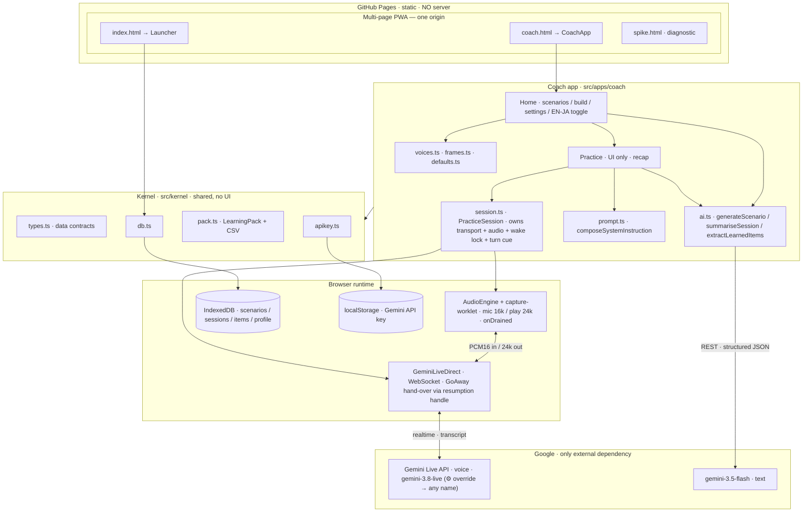
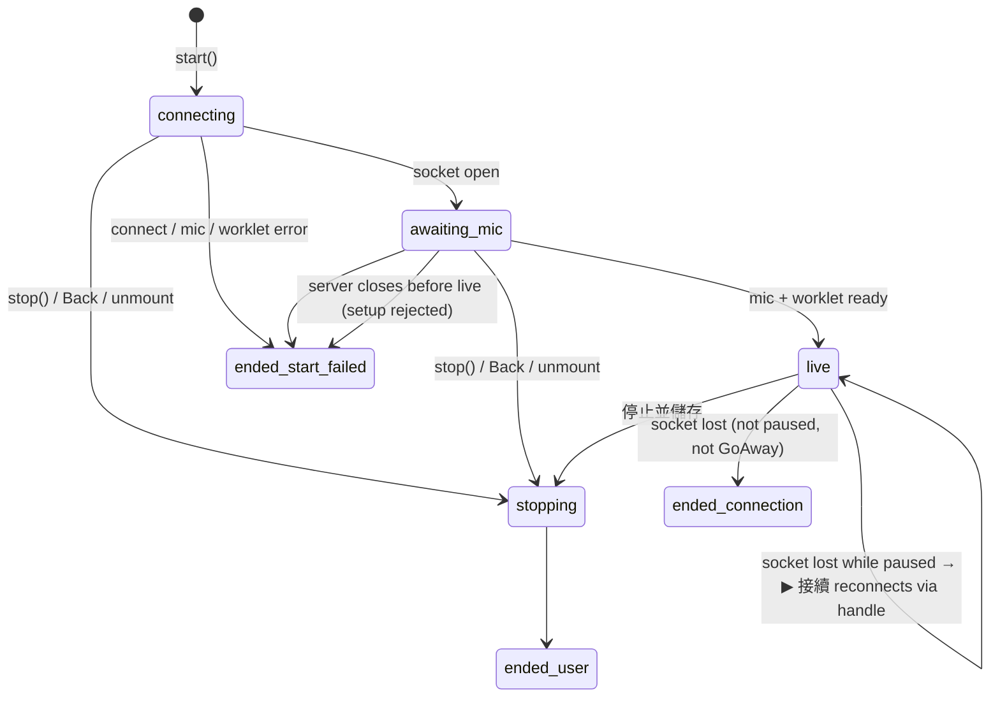
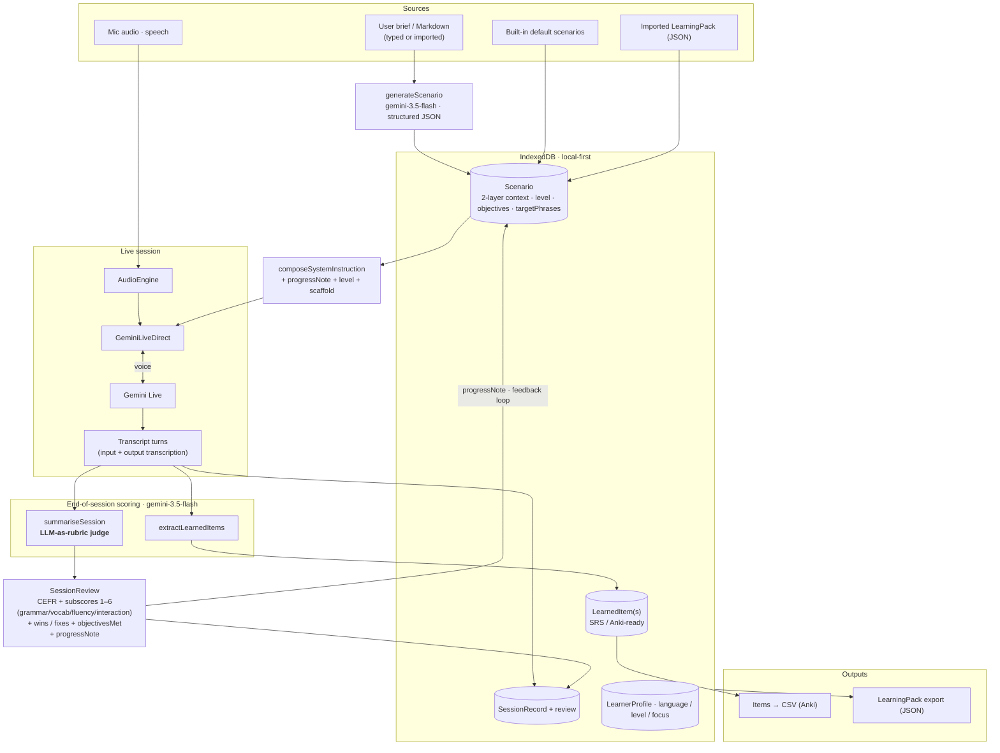

# Architecture

Two views: **(1) system architecture** (what runs where) and **(2) data pipeline**
(where data comes from, and how it is scored). Everything is pure-browser — the
only external dependency is Google's Gemini API.

## 1) System architecture

```mermaid
flowchart TB
  subgraph Host["GitHub Pages · static · NO server"]
    subgraph Pages["Multi-page PWA — one origin"]
      L["index.html → Launcher"]
      C["coach.html → CoachApp"]
      Sp["spike.html · diagnostic"]
    end
  end

  subgraph Coach["Coach app · src/apps/coach"]
    Home["Home · scenarios / build / settings / EN-JA toggle"]
    Practice["Practice · UI only · recap"]
    Session["session.ts · PracticeSession · owns transport + audio + wake lock + turn cue"]
    Prompt["prompt.ts · composeSystemInstruction"]
    AI["ai.ts · generateScenario / summariseSession / extractLearnedItems"]
    Content["voices.ts · frames.ts · defaults.ts"]
  end

  subgraph Kernel["Kernel · src/kernel · shared, no UI"]
    Types["types.ts · data contracts"]
    DB["db.ts"]
    Pack["pack.ts · LearningPack + CSV"]
    Key["apikey.ts"]
  end

  subgraph Runtime["Browser runtime"]
    Audio["AudioEngine + capture-worklet · mic 16k / play 24k · onDrained"]
    Direct["GeminiLiveDirect · WebSocket · GoAway hand-over via resumption handle"]
    IDB[("IndexedDB · scenarios / sessions / items / profile")]
    LS[("localStorage · Gemini API key")]
  end

  subgraph Ext["Google · only external dependency"]
    Live["Gemini Live API · voice · gemini-3.8-live (⚙️ override → any name)"]
    Flash["gemini-3.5-flash · text"]
  end

  C --> Home --> Practice
  Practice --> Prompt & AI & Session
  Session --> Audio & Direct
  Home --> AI & Content
  Coach --> Kernel
  DB --> IDB
  Key --> LS
  Audio <-->|"PCM16 in / 24k out"| Direct
  Direct <-->|"realtime · transcript"| Live
  AI -->|"REST · structured JSON"| Flash
  L --> DB
```

**Notes** — no backend, no auth server: the key lives in `localStorage` and the
browser talks straight to Gemini. All learner data is local (`IndexedDB`),
portable via a `LearningPack` JSON file. Tools share one origin so they share the
same kernel/DB.

### Live session lifecycle (`src/apps/coach/session.ts`)

```mermaid
stateDiagram-v2
  [*] --> connecting: start()
  connecting --> awaiting_mic: socket open
  awaiting_mic --> live: mic + worklet ready
  live --> live: GoAway → resumed socket (reconnecting flag)
  live --> live: pause / resume
  connecting --> stopping: stop() / Back / unmount
  awaiting_mic --> stopping: stop() / Back / unmount
  live --> stopping: 停止並儲存
  stopping --> ended_user
  connecting --> ended_start_failed: connect / mic / worklet error
  awaiting_mic --> ended_start_failed
  live --> ended_connection: socket lost (not paused, not GoAway)
  live --> live: socket lost while paused → ▶ 接續 reconnects via handle
  awaiting_mic --> ended_start_failed: server closes before live (setup rejected)
```

- **One owner, one generation counter.** `PracticeSession` holds the transport,
  the `AudioEngine` and the wake lock. `start()` is three awaits (connect, mic,
  worklet); each re-checks the generation it began under, so a Stop landing
  between two awaits releases the resource that arrives late instead of storing
  it. Callbacks from a superseded transport or engine are dropped the same way.
  `Practice.tsx` depends only on the session interface; it never sees SDK types
  or device handles, and tests drive the owner with stand-ins at exactly the
  transport / audio boundary.
- **Session length is the learner's.** Setup asks for
  `contextWindowCompression.slidingWindow` (the server trims old turns instead of
  ending the session at its context limit) and `sessionResumption`. When the
  server sends `goAway`, the transport opens a new socket with the latest
  resumption handle, retires the old one, buffers mic audio in between, and
  emits `onReconnecting` / `onResumed`; the UI shows「重新連線中…」and the
  transcript continues. One attempt per `goAway`, with a 15 s deadline; a failed
  or timed-out hand-over ends the session through `onClose`. A `goAway` that
  lands after the user's Stop is ignored, and a `goAway` mid coach turn closes
  that turn like a barge-in (its `turnComplete` will never arrive).
- **「換你說」follows the loudspeaker.** The protocol's `turnComplete` means the
  model finished *generating*; at 0.85× speed or on a long sentence the audio is
  still playing. The engine tracks scheduled buffer nodes and reports
  `onDrained` when the last one ends; the owner flips the cue only when
  `turnComplete` **and** drained both hold. `interrupted` (barge-in) flips it at
  once. A drain that arrives mid-turn (network slower than playback) is not a cue.
- **Model features.** `proactivity.proactiveAudio` and `enableAffectiveDialog`
  are independent flags (both on) supported by `gemini-3.8-live`; they are not
  prompt changes. The ⚙️ override can name any live model, including the legacy
  `gemini-3.1-flash-live-preview`; whether that legacy model accepts these flags
  has not been verified — if setup is rejected, the flags are the first suspect.
- **Lost connection ≠ lost words.** A drop leaves the transcript on screen in
  the「連線中斷」state with「儲存這段」(runs the normal finalize) and「重新開始」.

## 2) Data pipeline (sources → scoring → storage → feedback)

```mermaid
flowchart TB
  subgraph Sources["Sources"]
    Brief["User brief / Markdown<br/>(typed or imported)"]
    Defaults["Built-in default scenarios"]
    PackIn["Imported LearningPack (JSON)"]
    Mic["Mic audio · speech"]
  end

  Gen["generateScenario<br/>gemini-3.5-flash · structured JSON"]
  Scen[("Scenario<br/>2-layer context · level · objectives · targetPhrases")]
  Brief --> Gen --> Scen
  Defaults --> Scen
  PackIn --> Scen

  subgraph LiveSession["Live session"]
    Mic --> AE["AudioEngine"] --> GLD["GeminiLiveDirect"]
    GLD <-->|"voice"| GLive["Gemini Live"]
    GLive --> TR["Transcript turns<br/>(input + output transcription)"]
  end
  Scen --> Prompt["composeSystemInstruction<br/>+ progressNote + level + scaffold"] --> GLD

  subgraph Scoring["End-of-session scoring · gemini-3.5-flash"]
    Judge["summariseSession<br/><b>LLM-as-rubric judge</b>"]
    Extract["extractLearnedItems"]
  end
  TR --> Judge
  TR --> Extract
  Judge --> Review["SessionReview<br/>CEFR + subscores 1–6<br/>(grammar/vocab/fluency/interaction)<br/>+ wins / fixes + objectivesMet<br/>+ progressNote"]
  Extract --> Items[("LearnedItem(s)<br/>SRS / Anki-ready")]

  subgraph Store["IndexedDB · local-first"]
    Sess[("SessionRecord + review")]
    Items
    Scen
    Prof[("LearnerProfile · language / level / focus")]
  end
  TR --> Sess
  Review --> Sess
  Review -->|"progressNote · feedback loop"| Scen

  subgraph Out["Outputs"]
    CSV["Items → CSV (Anki)"]
    PackOut["LearningPack export (JSON)"]
  end
  Items --> CSV
  Store --> PackOut
```

### Scoring mechanism (the "judge")
At session end, the stored transcript is sent **once** to `gemini-3.5-flash` as an
**LLM-as-rubric judge** (`summariseSession`):

- **CEFR** — an honest overall estimate of *this* conversation.
- **Per-skill subscores** — integers **1–6 (A1…C2)** for grammar / vocab /
  fluency / interaction (numeric so a running level estimate can be derived).
- **objectivesMet** — each of the scenario's own objectives graded met/not from
  the learner's actual speech.
- **wins / fixes** — what went well, and the top items to fix *with the natural
  correction*.
- **progressNote** — concrete points to target next time; **fed back** into the
  next session's prompt (the feedback loop above), so coaching compounds.

A second cheap call (`extractLearnedItems`) turns the transcript into
`LearnedItem`s (vocab/phrase/grammar), the interop unit other tools/export consume.

> Honest scope: speaking-CEFR from a transcript is an *estimate*, treated as
> holistic guidance, not a calibrated grade. No server-side acoustic scoring.
> Planned hardening (see ROADMAP.md): self-consistency (median of samples),
> per-skill EWMA level state, and a deterministic lexical second opinion.
