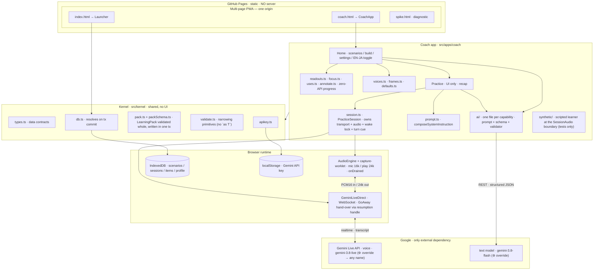
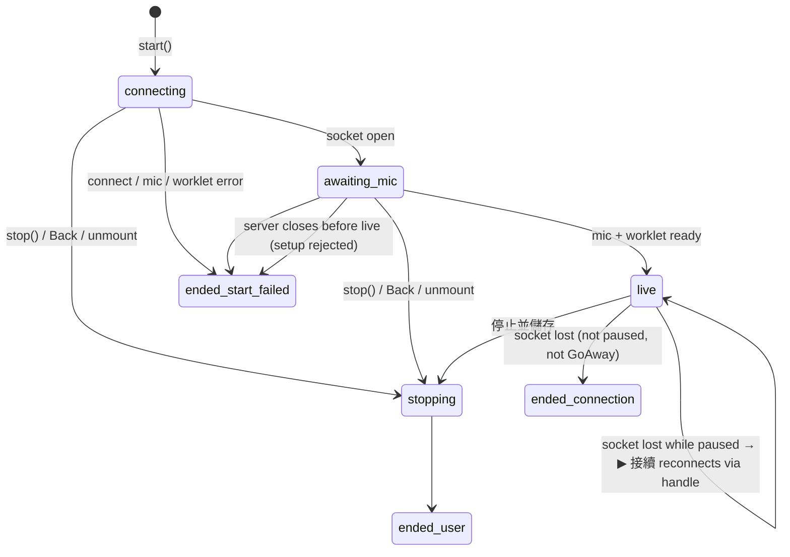
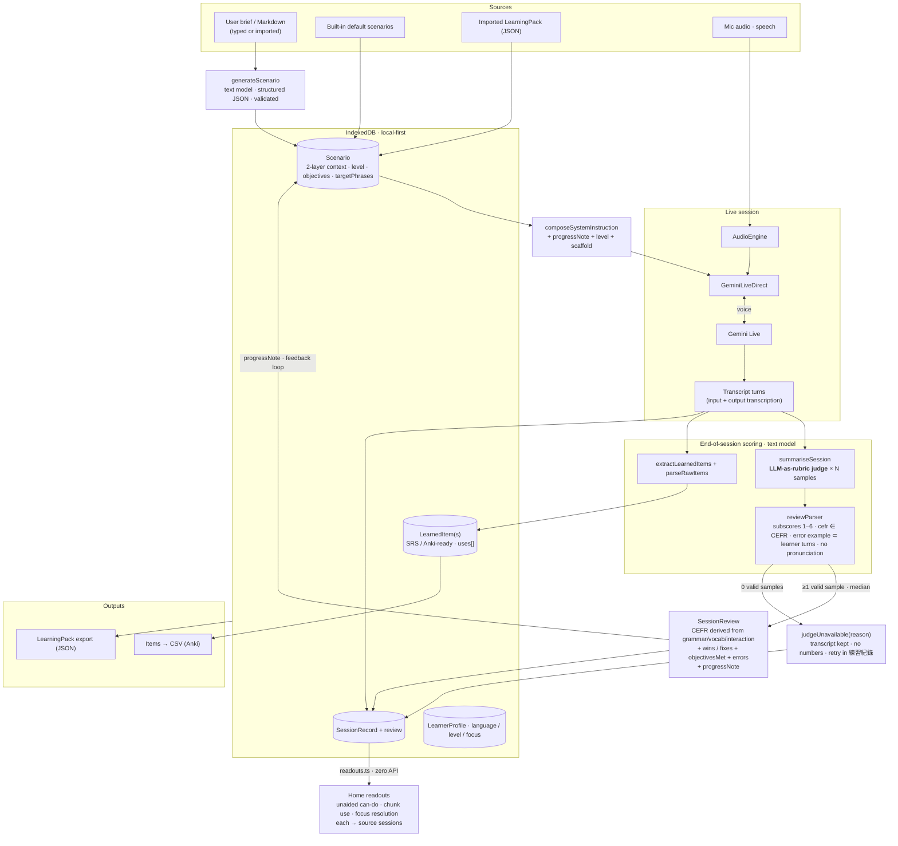

# Architecture

Two views: **(1) system architecture** (what runs where) and **(2) data pipeline**
(where data comes from, and how it is scored). Everything is pure-browser — the
only external dependency is Google's Gemini API.

## 1) System architecture

```mermaid
flowchart TB
  subgraph Host["GitHub Pages · static · NO server"]
    subgraph Pages["Multi-page PWA — one origin"]
      L["index.html → Launcher"]
      C["coach.html → CoachApp"]
      Sp["spike.html · diagnostic"]
    end
  end

  subgraph Coach["Coach app · src/apps/coach"]
    Home["Home · scenarios / build / settings / EN-JA toggle"]
    Practice["Practice · UI only · recap"]
    Session["session.ts · PracticeSession · owns transport + audio + wake lock + turn cue"]
    Prompt["prompt.ts · composeSystemInstruction"]
    AI["ai/ · one file per capability · prompt + schema + validator"]
    Readouts["readouts.ts · focus.ts · uses.ts · annotate.ts · zero-API progress"]
    Synth["synthetic/ · scripted learner at the SessionAudio boundary (tests only)"]
    Content["voices.ts · frames.ts · defaults.ts"]
  end

  subgraph Kernel["Kernel · src/kernel · shared, no UI"]
    Types["types.ts · data contracts"]
    DB["db.ts · resolves on tx commit"]
    Pack["pack.ts + packSchema.ts · LearningPack validated whole, written in one tx"]
    Validate["validate.ts · narrowing primitives (no `as T`)"]
    Key["apikey.ts"]
  end

  subgraph Runtime["Browser runtime"]
    Audio["AudioEngine + capture-worklet · mic 16k / play 24k · onDrained"]
    Direct["GeminiLiveDirect · WebSocket · GoAway hand-over via resumption handle"]
    IDB[("IndexedDB · scenarios / sessions / items / profile")]
    LS[("localStorage · Gemini API key")]
  end

  subgraph Ext["Google · only external dependency"]
    Live["Gemini Live API · voice · gemini-3.8-live (⚙️ override → any name)"]
    Flash["text model · gemini-3.8-flash (⚙️ override)"]
  end

  C --> Home --> Practice
  Practice --> Prompt & AI & Session
  Session --> Audio & Direct
  Home --> AI & Content & Readouts
  Coach --> Kernel
  DB --> IDB
  Key --> LS
  Audio <-->|"PCM16 in / 24k out"| Direct
  Direct <-->|"realtime · transcript"| Live
  AI -->|"REST · structured JSON"| Flash
  L --> DB
```

**Notes** — no backend, no auth server: the key lives in `localStorage` and the
browser talks straight to Gemini. All learner data is local (`IndexedDB`),
portable via a `LearningPack` JSON file. Tools share one origin so they share the
same kernel/DB.

### Live session lifecycle (`src/apps/coach/session.ts`)

```mermaid
stateDiagram-v2
  [*] --> connecting: start()
  connecting --> awaiting_mic: socket open
  awaiting_mic --> live: mic + worklet ready
  live --> live: GoAway → resumed socket (reconnecting flag)
  live --> live: pause / resume
  connecting --> stopping: stop() / Back / unmount
  awaiting_mic --> stopping: stop() / Back / unmount
  live --> stopping: 停止並儲存
  stopping --> ended_user
  connecting --> ended_start_failed: connect / mic / worklet error
  awaiting_mic --> ended_start_failed
  live --> ended_connection: socket lost (not paused, not GoAway)
  live --> live: socket lost while paused → ▶ 接續 reconnects via handle
  awaiting_mic --> ended_start_failed: server closes before live (setup rejected)
```

- **One owner, one generation counter.** `PracticeSession` holds the transport,
  the `AudioEngine` and the wake lock. `start()` is three awaits (connect, mic,
  worklet); each re-checks the generation it began under, so a Stop landing
  between two awaits releases the resource that arrives late instead of storing
  it. Callbacks from a superseded transport or engine are dropped the same way.
  `Practice.tsx` depends only on the session interface; it never sees SDK types
  or device handles, and tests drive the owner with stand-ins at exactly the
  transport / audio boundary.
- **Session length is the learner's.** Setup asks for
  `contextWindowCompression.slidingWindow` (the server trims old turns instead of
  ending the session at its context limit) and `sessionResumption`. When the
  server sends `goAway`, the transport opens a new socket with the latest
  resumption handle, retires the old one, buffers mic audio in between, and
  emits `onReconnecting` / `onResumed`; the UI shows「重新連線中…」and the
  transcript continues. One attempt per `goAway`, with a 15 s deadline; a failed
  or timed-out hand-over ends the session through `onClose`. A `goAway` that
  lands after the user's Stop is ignored, and a `goAway` mid coach turn closes
  that turn like a barge-in (its `turnComplete` will never arrive).
- **「換你說」follows the loudspeaker.** The protocol's `turnComplete` means the
  model finished *generating*; at 0.85× speed or on a long sentence the audio is
  still playing. The engine tracks scheduled buffer nodes and reports
  `onDrained` when the last one ends; the owner flips the cue only when
  `turnComplete` **and** drained both hold. `interrupted` (barge-in) flips it at
  once. A drain that arrives mid-turn (network slower than playback) is not a cue.
- **Model features.** `proactivity.proactiveAudio` and `enableAffectiveDialog`
  are independent flags (both OFF by default since 2026-10-05: proactive audio
  lets the model stay silent on speech it judges "not addressed to it", which a
  tutor must never do; affective dialog made the model refuse audio) supported by
  `gemini-3.8-live`; they are not
  prompt changes. The ⚙️ override can name any live model, including the legacy
  `gemini-3.1-flash-live-preview`; whether that legacy model accepts these flags
  has not been verified — if setup is rejected, the flags are the first suspect.
- **Lost connection ≠ lost words.** A drop leaves the transcript on screen in
  the「連線中斷」state with「儲存這段」(runs the normal finalize) and「重新開始」.

## 2) Data pipeline (sources → scoring → storage → feedback)

```mermaid
flowchart TB
  subgraph Sources["Sources"]
    Brief["User brief / Markdown<br/>(typed or imported)"]
    Defaults["Built-in default scenarios"]
    PackIn["Imported LearningPack (JSON)"]
    Mic["Mic audio · speech"]
  end

  Gen["generateScenario<br/>text model · structured JSON · validated"]
  Scen[("Scenario<br/>2-layer context · level · objectives · targetPhrases")]
  Brief --> Gen --> Scen
  Defaults --> Scen
  PackIn --> Scen

  subgraph LiveSession["Live session"]
    Mic --> AE["AudioEngine"] --> GLD["GeminiLiveDirect"]
    GLD <-->|"voice"| GLive["Gemini Live"]
    GLive --> TR["Transcript turns<br/>(input + output transcription)"]
  end
  Scen --> Prompt["composeSystemInstruction<br/>+ progressNote + level + scaffold"] --> GLD

  subgraph Scoring["End-of-session scoring · text model"]
    Judge["summariseSession<br/><b>LLM-as-rubric judge</b> × N samples"]
    Val["reviewParser<br/>subscores 1–6 · cefr ∈ CEFR · error example ⊂ learner turns · no pronunciation"]
    Extract["extractLearnedItems + parseRawItems"]
  end
  TR --> Judge --> Val
  TR --> Extract
  Val -->|"≥1 valid sample · median"| Review["SessionReview<br/>CEFR derived from grammar/vocab/interaction<br/>+ wins / fixes + objectivesMet + errors<br/>+ progressNote"]
  Val -->|"0 valid samples"| Unavail["judgeUnavailable(reason)<br/>transcript kept · no numbers · retry in 練習紀錄"]
  Extract --> Items[("LearnedItem(s)<br/>SRS / Anki-ready · uses[]")]

  subgraph Store["IndexedDB · local-first"]
    Sess[("SessionRecord + review")]
    Items
    Scen
    Prof[("LearnerProfile · language / level / focus")]
  end
  TR --> Sess
  Review --> Sess
  Unavail --> Sess
  Review -->|"progressNote · feedback loop"| Scen
  Sess -->|"readouts.ts · zero API"| Read["Home readouts<br/>unaided can-do · chunk use · focus resolution<br/>each → source sessions"]

  subgraph Out["Outputs"]
    CSV["Items → CSV (Anki)"]
    PackOut["LearningPack export (JSON)"]
  end
  Items --> CSV
  Store --> PackOut
```

### Scoring mechanism (the "judge")
At session end the transcript is sent to the text model (`kernel/overrides.ts`:
`textModel()`, default `gemini-3.8-flash`) **N times** (`judgeSamples()`, default 1 — see `docs/SCREENING_2026-09-24.md`)
as an **LLM-as-rubric judge** (`ai/review.ts`). Every sample passes `reviewParser`
or is discarded:

- **subscores** — integers **1–6 (A1…C2)** for grammar / vocab / fluency /
  interaction; a float or an out-of-range value voids the sample.
- **cefr** — the model's label must be a CEFR level, but the stored **CEFR is
  derived** from grammar / vocab / interaction (fluency is mostly inaudible in a
  text transcript, so it does not drive the level).
- **errors** — a closed set of types (`pronunciation` is never accepted: text
  cannot evidence it), and each `example` must be a substring of a learner turn;
  otherwise that error is dropped. With several samples a type must survive a
  majority vote (`progress.voteErrors`); with the default single sample the
  validator is the evidence.
- **objectivesMet / wins / fixes / progressNote** — shape-checked; progressNote is
  **fed back** into the next session's prompt (the feedback loop above). An
  objective is met **only when completed entirely in the target language**: a
  turn labelled `[repeated after coach]` or `[contains Chinese]` (see
  *Turn annotations*) is not evidence.
- **l1Fallbacks** — `{said, target}` pairs for words the learner replaced with
  Chinese; `said` must be a substring of a learner turn (≤5). A vocabulary gap,
  not an error type: it feeds the focus and the item extractor only.
- **pronunciationNotes** — sounds the **coach** named, each a substring of a coach
  turn (≤3). Stored on `profile.accentNotes[language]` (replaced each session)
  and read back into the next prompt; never a readout, never in the EWMA.

Surviving samples are medianed (`medianReview`). **Zero surviving samples**, a
transcript in which the learner never spoke, or one in which every learner turn
is an echo or Chinese (`unjudgeable`, decided before any call), yields
`JudgeOutcome.unavailable`: the session is stored with its transcript and
`judgeUnavailable(reason)`, the level / error tally / progress note are **not**
touched, and 練習紀錄 offers「重試評量」(`finalize.retryReview`). The target
level is never used as a score.

### Turn annotations (`annotate.ts`) — zero API, at finalize
`annotateTurns(transcript, language, aidedTurnIdx)` is a pure function over the
text; each flag is stored on the turn only as `true`, so a record from an older
build reads as unflagged (the ordinary case).

| flag | rule | who reads it |
|---|---|---|
| `echo` | ≥ 0.8 of the learner turn's tokens (en: words, ja: characters) occur in the coach's **previous** line, and the turn has ≥ 3 words / ≥ 6 characters | judge label, chunk use |
| `aided` | the learner turn after a spoken `HELP_TRIGGERS` phrase (one exported list, used verbatim in the prompt's help section) or after a「卡住?」/ translate tap (`aidedTurnIdx`) | readout a (session counts as aided), chunk use |
| `l1` | en practice: Han / kana in the turn; ja practice: text cannot tell, so `markL1FromFallbacks` marks the turns the judge's `l1Fallbacks.said` occur in | judge label, chunk use, focus |

`isOwnProduction(turn)` = a learner turn with none of the three; only those turns
count as the learner reaching for a taught item.

### Finalize (`finalize.ts`) — every result exactly once
Order: transcript saved → draft cleared → **claim** (a `FinalizeLedger` on the
session; a second runner within 10 minutes gets `already`) → items + judge run
independently (`allSettled`) → each result applied and **ticked** on the ledger
(`itemsSaved`, `reviewApplied`, `arcAdvanced`), so a re-run (draft recovery,
another tab, a retry) applies only what is missing. Items are deduped by
`sourceSessionId`; the profile is re-read before the level fold so another
tab's change survives; the story arc advances after the results boundary.
Everything the pipeline touches is injected (`FinalizeDeps`) and tested in memory.
The transcript is stored **annotated**; after the review lands the judge's
`l1Fallbacks` are folded back into the turns; the one focus is picked from the
**folded** profile and stored on the record as `focus: SessionFocus`
(`FinalizeOutcome.done.focus` is that same value, so the recap card never
recomputes it). A micro session stores `drilledFocus.sourceSessionId`. The due
item ids the coach was asked to recycle are stored as `recycled`.

### Readouts (`readouts.ts`) — zero API, traceable, counted by session order only
| readout | numerator / denominator | source sessions |
|---|---|---|
| 無提示做到 | met verdicts / all verdicts, in the last 10 judged sessions with an `aids` record of zero **and no `aided` turn** (sessions without an aids record are excluded, not assumed unaided) | those sessions |
| 教過的用出來 | recycled items the learner then produced in that session (`uses.ts`, own production only) / `recycled` ids summed over the window's sessions (sessions without a `recycled` record are excluded) | the sessions with a use |
| 焦點沒再犯 | error-type focuses (`meaning` / `recurring`) whose type does not appear in `review.errors` of the **next two** full judged sessions / focuses with two follow-ups; split into **有加練** (a micro session with `drilledFocus` pointing at it) and **沒加練** | the focus sessions |

A readout is `null` (not shown) when its denominator is empty; a focus with fewer
than two later sessions is unknown, not unresolved. Nothing here counts days,
gaps or how often the learner practises. Trend compares the recent half of the
window with the earlier half. Tapping a line opens 練習紀錄 filtered to its
sources. Presentation lives in `ReadoutStrip.tsx`.

### Focus and micro session (`focus.ts`, `microCutoff.ts`)
The recap shows **one** focus: a meaning-blocking error (word choice / order,
particle, tense) > a vocabulary **gap** (≥2 `l1Fallbacks`) > an error recurring
in ≥2 sessions > an unmet can-do. 「再練 90 秒」restarts the same scenario with a
drill-only instruction — `sessionInstruction` drops due items, weak objectives
and the story continuity for it — and finalizes as `kind:"micro"`: transcript
saved (it counts for chunk use), no judge, no items, no level fold, no reminder
anywhere. The prompt asks for a 90-second wrap-up; `armMicroCutoff` stops a
micro session through the owner's own Stop at 120 s. A full session has no timer.

### Coaching the accent and the gap (`prompt.ts`)
Accent feedback comes only from a **closed list** of sounds per language, at most
once every three or four exchanges, modelled once and said back once — never
rated. Chinese inside a target-language sentence is treated as a **vocabulary
gap**: the word is given at once (with a 繁中 gloss; for Japanese, kana + romaji),
the learner repeats the whole sentence in the target language, and a second slip
on the same word gets only its first sound. The extractor prefers those words as
items, with the coach's target-language sentence as the example; grammar items
may carry a `frame` (`I'd rather ___ than ___`) whose anchors `uses.ts` matches
in order.

### Synthetic learner (`synthetic/`, tests only)
`SyntheticLearnerAudio` implements `SessionAudio` at the owner's injection point:
coach audio is accounted for by duration on a clock, `say()` streams a cached
line as 20 ms frames plus 600 ms of silence, and idle silence flows between
lines like a microphone. `synthLines` synthesises each scripted line once with
`gemini-3.8-flash-lite-tts` into `.synthetic-cache/<sha256>.pcm` (gitignored,
≤60 new lines a run). `synthetic.e2e.test.ts` (`SYNTH=1`) runs the real
`PracticeSession`, the real Live transport and the real judge with it — every
script ≤12 lines / ≤4 minutes in code. What it proves is worded「合成已驗證」:
protocol, lifecycle and pipeline on real audio; nothing about a phone or a person.

### Import (`pack.ts` + `packSchema.ts`)
`planImport(unknown)` rebuilds every record from narrowed fields — one invalid
record refuses the whole file with its path (illegal enum, wrong transcript shape,
an arc episode pointing at a scenario in neither pack nor store, unsupported
version) — and reports adds vs overwrites; after the user confirms,
`commitImport` writes everything in **one** cross-store transaction.

> Honest scope: speaking-CEFR from a transcript is an *estimate*, treated as
> holistic guidance, not a calibrated grade. No acoustic scoring; pronunciation
> feedback lives in the live coach turn, not in the judge.
