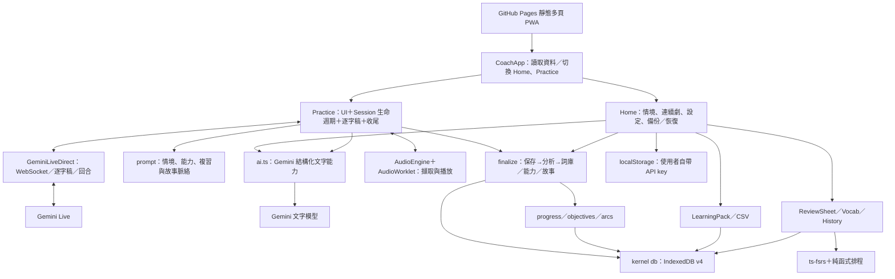
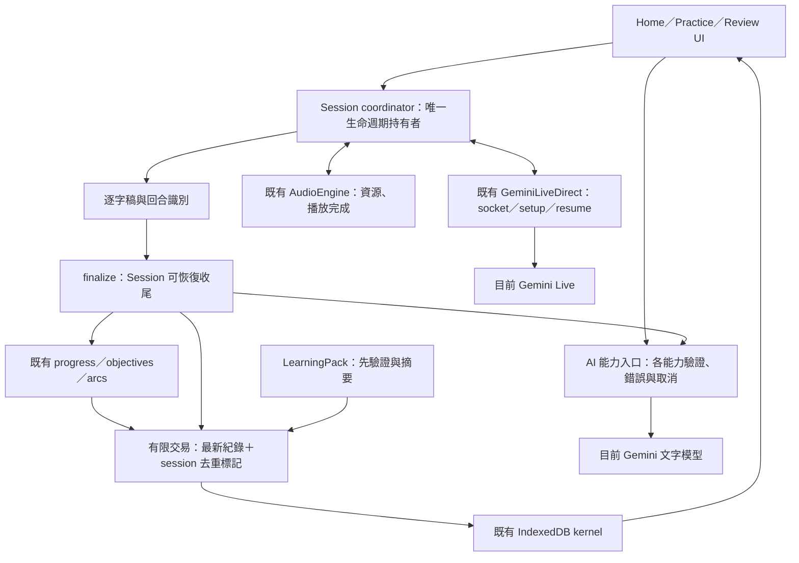

# EngCoach 獨立架構與使用體驗診斷

日期：2026-09-23。對象：[ZeroAlcoholic/eng-dialogue-coach](https://github.com/ZeroAlcoholic/eng-dialogue-coach)。

**結論：現有架構適合個人使用的 local-first 語音教練，已有值得保留的模組邊界；最有價值的改善是補齊 Session、資料提交、AI 結果與恢復操作的契約。無需改成企業平台，也不需要引入模型工具呼叫框架。**

這是額外獨立診斷，與 NapDemo 的開發收尾、藍圖、驗收與提交分開。僅參考 NapDemo 的工程經驗，沒有引用其測試結果證明 EngCoach 正確。未修改 EngCoach 原始碼、安裝依賴、執行模型／麥克風或部署。

## 1. 診斷來源與證據等級

使用者指定的本機快照實際根目錄為：

`C:/Develop/NapDemo/sample/EngCoach/eng-coach-main/eng-coach-main`

下文檔名與行號皆相對此根目錄。本機沒有 `.git`，**branch／commit SHA 不可確認，也不能聲稱與 GitHub 最新 HEAD 一致**。未在快照搜尋到 AGENTS.md／CLAUDE.md；程式中提及的舊 CLAUDE 規則不當作本次額外授權。

主要證據入口：[Practice 啟動與停止](C:/Develop/NapDemo/sample/EngCoach/eng-coach-main/eng-coach-main/src/apps/coach/Practice.tsx:185)、[DB 提交語意](C:/Develop/NapDemo/sample/EngCoach/eng-coach-main/eng-coach-main/src/kernel/db.ts:68)、[AI 評量失敗分支](C:/Develop/NapDemo/sample/EngCoach/eng-coach-main/eng-coach-main/src/apps/coach/ai.ts:223)、[收尾流程](C:/Develop/NapDemo/sample/EngCoach/eng-coach-main/eng-coach-main/src/apps/coach/finalize.ts:72)。

| 快照識別 | 值 |
| --- | --- |
| package 名稱／版本 | `english-coach-pwa`／`0.1.0` |
| lockfile 實際版本 | `@google/genai 2.7.0`、`react 19.2.6`、`ts-fsrs 5.4.1`、`vite 6.4.2`、`vitest 2.1.9` |
| package-lock.json SHA256 | `A14FE56CC82E0CCC1FCAF43D2FD9BF6848B687C1597CE82C5CCEE6D41AD6536B` |
| Practice.tsx SHA256 | `A1CC30F3AF2E58ECC3020519E7ACE1B0C06810BF4E8D4D8452C2DF3706B3DC92` |

檢視範圍：README、ARCHITECTURE、manifest／lockfile、Vite／Vitest／部署工作流、CoachApp、Home、Practice、GeminiLiveDirect、AudioEngine、AI helpers、finalize、IndexedDB、LearningPack、progress／objectives／arcs、FSRS／ReviewSheet、Sheet、Shadowing 與既有裝置驗證紀錄；追蹤首次設定、練習、停止保存、回饋複習及恢復的代表路徑。

證據標記：**程式事實**＝直接讀到的分支或責任；**條件式風險**＝由特定時序／失敗條件推導，未實際重現；**UX 建議**＝需實機或使用者驗證。未跑本專案測試與 build，未宣稱實際發生洩漏／遺失或已驗收改善。

GitHub 來源起初無法取得：Git clone 回 `schannel: AcquireCredentialsHandle failed: SEC_E_NO_CREDENTIALS (0x8009030e)`，repo／README API 回 404，`gh api user` 回 401；Chrome CUA 連線不可用。使用者後續提供上述快照，故本報告已轉為原始碼診斷。404 本身不證明 repo 不存在或私有。[GitHub 說明](https://docs.github.com/en/rest/using-the-rest-api/troubleshooting-the-rest-api#404-not-found-for-an-existing-resource)

## 2. 現況架構與應保留能力

值得保留：

- **local-first 定位清楚**：無後端，個人 BYOK，IndexedDB＋可攜 LearningPack；不因「強健」就改成帳號／伺服器平台。
- **已有實質分層**：transport、audio、kernel 與學習規則可分辨；FSRS 使用現成 `ts-fsrs`，不自造排程演算法。
- **資料與 UX 已考慮失敗**：finalize 先存逐字稿；區分 `PersistError` 與 `ResultsPersistError`；草稿每約 1.2 秒備份、wake lock、中文錯誤、歷史與複習入口均已存在。
- **部分交易做法正確**：`src/kernel/db.ts:124` 的 putItems 等待 transaction complete；`src/kernel/db.ts:241` 的 putArcWithScenario 將劇集與情境同交易寫入，含預期集數競態檢查。應把這些語意補到其他路徑，不重寫整個儲存層。
- **學習介面已有節制**：複習一次最多 20 張；挖空先利用已有例句，必要才生成；Shadowing 是 A/B 自聽而非假精準發音分數。

### 「工具群」在這個專案的真實含義

README 的 folder of tools 是共用 kernel 的應用集合。`src` 掃描未見 `functionDeclarations`、`toolCall` 或 `sendToolResponse`；Live 設定也沒有模型 function-call 工具宣告。因此不能把 NapDemo 的業務工具路由搬進來。

目前真正需要完善的是下列**可呼叫能力群**：

| 能力群 | 現有入口 | 應完善的契約 |
| --- | --- | --- |
| 即時對話 | GeminiLiveDirect.connect／sendAudio／reconnect／close | socket open、模型 ready、收音 ready 分開；取消與晚到事件隔離 |
| 音訊操作 | AudioEngine.start／pauseMic／resumeMic／stop | 取得資源即納入清理；啟動失敗／停止交錯也能釋放；播放完成獨立事件 |
| AI 學習能力 | generateScenario、summariseSession、extractLearnedItems、suggestReplies、translateLine、arc generation、review extras | 不可信輸出 runtime 驗證；成功／部分成功／失敗；取消、逾時與上下文識別 |
| 學習提交 | finalizeSession、progress、objectives、arcs | 逐字稿先落地；結果以 sessionId 去重；更新最新紀錄；恢復可重試 |
| 資料交換 | importPack／buildPack／CSV | 完整驗證後才寫；回報導入差異與結果；防無效資料污染正常頁面 |

## 3. 優先發現：可靠性與資料正確性

成本為相對估計：低＝局部介面或 UI 修正；中＝跨模組與競態驗證。未看 runtime 不報精確工時。

### F1｜P1：啟動中的音訊／連線缺少完整所有權與取消邊界

**程式事實**：`src/apps/coach/Practice.tsx:279` 等待 connect，`:286` 等待 `engine.start()`，到 `:289` 才把 engine 存進 ref；teardown 只處理 ref（`:302`）。`src/audio/AudioEngine.ts:73` 先建立 AudioContext，`:77` 取麥克風，`:81` 再載 worklet，start 內沒有失敗清理。connect／start 的 await 後也沒有核對 session 世代或已停止狀態。

**條件式風險**：麥克風取得後 worklet 載入失敗時，catch 的 teardown 不認得這個尚未登記的 engine；若在 connect／麥克風授權等待中停止或卸載，晚完成的 start 仍可能建立資源。尚未實機證明洩漏發生率。

**最小修法**：資源建立後立即由同一 Session owner 持有；start 失敗自行清理；每次 start／resume 帶 generation 或 cancellation token，await 後確認仍有效，失效就釋放。不要全面引入狀態機套件。

**驗收**：延遲 connect／getUserMedia／worklet 各階段停止、卸載與拒權；最後無活動 track、AudioContext／socket 不殘留、舊 callback 不改新練習。成本中，主要風險是收尾順序回歸。

### F2｜P1：IndexedDB 的「已存」承諾早於 transaction commit

**程式事實**：`src/kernel/db.ts:68` 的 run 在 request `onsuccess`（`:76`）即 resolve，沒有 transaction complete／abort；putSession、putProfile、putScenario 都依賴它。相較之下 putItems 已正確等交易完成。

**條件式風險**：request 成功後若交易仍 abort，呼叫者已走成功；`src/apps/coach/finalize.ts:72–78` 可能繼續清草稿。這是提交語意缺口，不能據此宣稱現有使用者資料已遺失。IndexedDB 規格區分 request 成功與 transaction committed。[W3C IndexedDB](https://w3c.github.io/IndexedDB/)

**最小修法**：run 擷取結果但於 tx.oncomplete 才成功，onabort／onerror 失敗，整理連線關閉責任。逐字稿寫入與清除同一 session 草稿可使用小型明確交易。

**驗收**：request 成功後強制 abort，promise 必失敗、草稿仍可恢復；一般成功在 commit 後才顯示已儲存。成本低至中，不需換 ORM。

### F3｜P1：收尾重試與部分成功沒有穩定的 Session 提交契約

**程式事實**：`src/apps/coach/finalize.ts:78` 註解稱同 session 重做冪等，但 `src/apps/coach/ai.ts:132` 每次抽詞生成新的 UUID；`src/apps/coach/objectives.ts:67` 累加 attempts；`src/apps/coach/progress.ts:112` 累加 error count。finalize 沒有讀取同 session 已完成結果，`:92–107` 多個獨立寫入且使用呼叫時 profile。`:81` 的 Promise.all 讓抽詞失敗也阻止成功 review 的保存。

**條件式風險**：清草稿失敗後再次恢復、跨分頁同時恢復，或未來新增重試，都可能重複詞卡／累計評量；舊 profile 快照亦可能覆蓋其他分頁新偏好。目前 UI 不普遍提供分析重試，不能稱每次儲存都重複。

**最小修法**：沿用 sessionId，記錄 transcriptSaved／review 狀態／items 狀態／resultsApplied；抽詞與評量各有結果，資料準備好後在有限交易中更新最新 profile 並標記套用。相同 session 可補未完成步驟，不能再累加已完成統計。不需要工作佇列服務或事件溯源。

**驗收**：同 session finalize 兩次、清草稿失敗、抽詞單獨失敗、提交中斷、兩分頁競爭；詞卡與 attempts 只計一次、成功部分保留、舊偏好不回寫。成本中，涉及資料狀態向後相容。

### F4｜P1：AI 完全失敗會轉成看似正常回饋；輸出驗證不完整

**程式事實**：`src/apps/coach/ai.ts:223–232` 三次 judge 各 catch null，全失敗仍回傳以目標等級為 cefr 的空 fallback。若抽詞成功，finalize 會保存這份 review；恢復畫面 `src/apps/coach/Home.tsx:280` 可顯示「已救回…CEFR…」。`src/apps/coach/ai.ts:46` 是 JSON.parse 後直接 `as T`；進度模組驗證 error type／投票，但 `src/apps/coach/progress.ts:67` 沒核對 example 是否真存在使用者逐字稿。prompt `src/apps/coach/ai.ts:215` 要求 pronunciation 建議，而 judge 輸入只有文字逐字稿。

**影響**：服務失敗被誤解成學習成果；使用者原訂等級可能看起來像實測等級；多次模型一致不等於引用或發音證據成立。

**最小修法**：全 judge 失敗回明確 unavailable；保留成功抽詞，顯示「逐字稿已存，評量未完成」與重試。按各能力驗證必要欄位、enum／數值範圍；引用對應使用者回合，文字判讀不宣稱聲學發音評分。保留既有 error 投票作輔助。

**驗收**：三次全失敗、部分成功、CEFR 非法、分數超界、引用不存在、只有教練發言；不得寫入假測量。成本中。官方也要求結構化 JSON 在應用端驗值，而非把 schema 合規當語意正確。[Gemini structured output](https://ai.google.dev/gemini-api/docs/structured-output)

### F5｜P1：LearningPack 只驗 ID，格式正確的 JSON 仍可污染資料

**程式事實**：`src/apps/coach/Home.tsx:229` 直接 cast LearningPack；`src/kernel/pack.ts:87–107` 檢查 kind／version、以 id 篩選，但未驗完整 record；`:99` 可用非法 language 覆蓋 profile，`:100` 可保存缺欄位 scenario。後續 `src/apps/coach/Home.tsx:112` 直接使用 `DEFAULT_SCENARIOS[lang].filter`。這是一條可追蹤的無效資料→渲染失敗路徑，尚未在瀏覽器重現。

**最小修法**：入口接 unknown，驗根物件、版本、profile enums、各 record 必要欄位及關聯，全部通過後才提交；匯入前摘要新增／覆蓋項目。既有 arc reconcile 保留。不要把跳過不合法資料當無警告成功。

**驗收**：非法 language、缺 objectives、錯型別 transcript、缺失 arc 關聯、版本不支援，均不先改有效資料；正常匯出匯入保持 FSRS 與學習進度。成本中，先決定錯誤整包拒絕或清楚的部分導入政策。

## 4. 優先發現：使用體驗與操作

### U1｜P1：顯示「換你說」依模型完成，未等聲音播完

`src/api/gemini-direct.ts:159` 收到 turnComplete 立即發 you；Practice `:247` 直接改 phase。AudioEngine `:179–189` 用播放時鐘排程，尤其慢速 0.85 倍時，傳輸完成並不等於排程音訊已播完。**這是來源已證明的時鐘差異，提示實際提前多久未量測。**

最小修法：區分 modelTurnComplete 與 playbackDrained；「換你說」依實際播放清空或使用者打斷。語音同時可持續支援 barge-in，不必為了狀態文字關掉 full-duplex。驗收最後 chunk＋turnComplete 同包、慢速、長句、打斷；音訊還播時不提前提示。成本低至中。

### U2｜P1：連線、儲存、分析是不同等待，但畫面尚未完整分開

- `src/apps/coach/Practice.tsx:241` 在 socket onOpen 就 live，之後才 `engine.start()`；「練習中」可能先於麥克風可用。connecting 按鈕禁用且 Back 也 disabled，該分支沒有取消控制（`:449、520`）。
- 停止 `:411` 先 await 草稿保存才 teardown；應讓停止收音獨立於儲存等待。
- saving 一直到 finalize 回傳才結束，Back disabled；finalize 還會 await 下一集生成（`:142`）。`src/apps/coach/ai.ts:223` 是三次 judge 加一次抽詞，連續劇還多下一集，不是 ARCHITECTURE 描述的一次 judge。
- 正常 live 斷線 `:263–274` teardown 後回 ready；再次 Start `:194–204` 清逐字稿並換 sessionId。只有「暫停中斷線」走 resumption；一般斷線沒有同等續接操作。舊草稿可能留到首頁，但再次對話的草稿會覆蓋 singleton，需先封存／提供選擇。

最小修法：畫面分清連線中、等待麥克風、可對話、已停止且已保存、分析中／分析未完成。開始可取消；停止立即停止裝置，再存快照。逐字稿保存成功即可回首頁；分析可在 session 紀錄持續／重試，下一集不阻擋摘要。斷線提供「續接」或「存下這段並重新開始」，依 resume handle 是否有效決定。

驗收：慢權限／慢網路／模型全失敗／下一集失敗／普通斷線再開；永遠可停止，不謊稱已 ready 或已完成分析，不覆蓋未保存對話。成本中，和 F1／F3 合併設計但分項驗收。

### U3｜P2：共用 Sheet 宣稱 modal，卻沒有鍵盤焦點管理

`src/apps/coach/Sheet.tsx:9–18` 只有 Esc listener；`:30` 宣告 role dialog、aria-modal，但沒有開啟移焦、Tab 限制、背景 inert 或關閉還焦。所有歷史／詞庫／複習共用此元件，一處修正能改善整體操作。

最小修法：採原生 dialog 或既有成熟可存取元件；核對初始焦點、Tab／Shift+Tab、Esc、關閉回原按鈕。避免自行新增一套 UI framework。成本低。[W3C modal dialog pattern](https://www.w3.org/WAI/ARIA/apg/patterns/dialog-modal/)

### 建議的完整操作旅程

| 階段 | 保留目前優點 | 必要優化／驗收 |
| --- | --- | --- |
| 初次設定 | key 先 models.list 驗證、中文錯誤、內建情境 | 說清「金鑰可讀 API」不等於當前 Live／文字模型皆可用；不要用正式練習偷偷付費探測 |
| 開始練習 | Home→情境→大開始鈕；進階設定收折 | socket／setup／mic 狀態正確，權限等待可取消 |
| 對話 | 提示、翻譯、慢速、音量顯示、暫停 | 提示與翻譯帶當前 session／回合識別；晚回覆不污染重開；發話 cue 與播放同步 |
| 暫停與跟讀 | 暫停釋放麥克風；Shadowing 獨立 A/B 自聽 | 接續與錄音取得交錯也釋放資源；UI 清楚區分暫停收音、離線與結束 |
| 停止與摘要 | 本機先保存、區分寫入與分析失敗 | 即停、已存可離開、部分成功可讀、失敗分析可重試 |
| 歷史與恢復 | 有逐字稿、草稿恢復、備份 | History 無 review 現僅顯示無分析（HistorySheet）；補明確 retry／status，不靠草稿偶然殘留 |
| 複習再練 | FSRS、一次 20 張、三種方向、到期詞再帶回對話 | 保留同卡同排程；別把卡片評等次數當真實口說熟練；從回饋挑一項再練作 UX 小實驗 |

## 5. 建議目標架構：只補現有責任邊界

具體落點：先改善 `db.ts` 的成功語意與交易；`Practice` 只抽出一個有資源與取消責任的 Session coordinator；`ai.ts` 先把驗證和結果補齊，確有獨立變更需要時才按「情境／評量／輔助」分群。沿用 prompt、SRS、arcs、progress，不增通用 bus、DI 容器、plugin registry 或多供應商平台。

## 6. 最新技術評估：2026-09-23 官方查核

| 選項 | 本次官方查核 | 決策建議 |
| --- | --- | --- |
| Live 模型 | 官方目前列 `gemini-3.8-live` 為 stable／一般低延遲 Live 選項；快照預設 `gemini-3.1-flash-live-preview` 已列 legacy preview | 應做小範圍對比後才升級：EN／JA、音色、VAD、字幕、延遲、重連與成本。不直接把改模型名當修好生命週期。[Models](https://ai.google.dev/gemini-api/docs/models) |
| 文字模型 | 快照 `gemini-3.5-flash`；官方列表仍有此模型 | 不自動全換最新 Flash；先解 F4，取代表逐字稿評比品質與延遲。SDK 已用新 `@google/genai`，無需為流行更換 SDK。[Models](https://ai.google.dev/gemini-api/docs/models) |
| Live session resumption | 官方管理文件更新 2026-09-15；connection 有時限，續接與 context compression 各管不同限制 | 目前已有 resume handle，不是從零加；補正常斷線／GoAway 與不能續接的 UX，測 handle 與 token 的實際約束。[Session management](https://ai.google.dev/gemini-api/docs/live-api/session-management) |
| 短效 token | Gemini 官方為瀏覽器直連提供 Preview ephemeral token，目前文件為 Live API／v1beta，需後端簽發 | 本案已明確個人 BYOK，localStorage 是定位取捨，不能誤報「意外洩漏」。若轉共用金鑰／多人產品才新增最小授權後端；目前可選是否記住 key／一鍵移除，不強推伺服器。[Ephemeral tokens](https://ai.google.dev/gemini-api/docs/live-api/ephemeral-tokens) |
| Structured output | 官方強調應用端驗值與語意錯誤處理 | 直接適用 F4／F5；可用局部 validators，先不引通用 schema 編譯器。[Structured output](https://ai.google.dev/gemini-api/docs/structured-output) |
| Web Audio | Web Audio 1.1 最新查得 2026-09-22 Working Draft；本案已用 AudioWorklet | 不需「升級成 AudioWorklet」，已經存在；先修資源與播放時序，不採未確認瀏覽器支援的草案 API。[Web Audio](https://www.w3.org/TR/webaudio/) |
| 可存取操作 | WCAG 2.2 與 WAI-ARIA dialog 模式提供焦點／狀態要求 | 修共用 Sheet、保留 Practice 已有 role=status；鍵盤與小畫面做完整旅程。[WCAG 2.2](https://www.w3.org/TR/WCAG22/)、[Dialog](https://www.w3.org/WAI/ARIA/apg/patterns/dialog-modal/) |

不建議新增模型 function-call 工具群。若未來真的需要模型操作練習資料，才借鏡 NapDemo 的白名單、先驗證後副作用、版本／取消與結果契約；目前的問題可在現有能力介面內解決。

## 7. 分階段規劃工作清單（尚未開工）

### 第一批：可靠基底，優先於加功能

- [ ] F2：run 等 transaction commit；逐字稿與草稿交易語意一致。
- [ ] F1／U2：Session owner、啟動失敗 cleanup、generation／cancel、立即停止、晚到事件隔離。
- [ ] U1：區分模型生成完成與音訊播放完成。
- [ ] F4：AI 全失敗不再假成功；各能力 runtime 驗證；引用依據與評分範圍清楚。
- [ ] F5：LearningPack 全部驗證後再提交，回報衝突與無效資料。

### 第二批：收尾與恢復形成完整閉環

- [ ] F3：以 sessionId 記各步完成狀態，重試只補缺項，有限原子提交、讀最新 profile。
- [ ] 已保存與分析中分開；History 可重試評量；下一集生成不阻擋離開。
- [ ] 正常斷線明確續接／另存重開；舊逐字稿與 singleton draft 不被新練習無聲覆蓋。
- [ ] U3：共用 Sheet 焦點與鍵盤行為完善；提示／翻譯失敗有可理解回應。

### 第三批：有量測再做的改善

- [ ] 在第一、二批可靠後，比較 Gemini Live stable 候選；記錄實際品質、延遲、重連與用量。
- [ ] 評估三次 judge 的實際價值。先不砍次數；用固定代表逐字稿比較單次與三次的變異、引用正確率、等待時間與費用，無改善證據再簡化。
- [ ] 小規模試「摘要只列一項可執行改進＋立即再練」；不新增學習大平台。

### 每批驗收與停止條件

- [ ] 本機 targeted tests：交易 abort、AI 全失敗／錯輸出、同 session 重試、取消／晚到事件、匯入不改有效狀態。
- [ ] Chrome 瀏覽器整合：真 IndexedDB、可控 transport／audio 邊界注入，只證明本機流程；`channel: "chrome"`。
- [ ] 經另行授權，真 Live 與裝置驗證：第一句、慢速、barge-in、暫停／續接、斷網、停止、第二次練習、背景／鎖屏。替身不冒充真音訊品質。
- [ ] 保留既有測試與 CI gate，最終 typecheck／lint／unit／build 只算必要篩選，不能代替上述旅程。
- [ ] 核對最終 diff，沒有與缺口無關的 UI 重做或平台擴充。上述缺口有直接驗收即停止，不追求抽象層或模組數量。

## 8. 驗證限制與交付界線

本次完成的是**本機快照的靜態架構／流程診斷與官方技術查核**。沒有實機重現、基準測速、付費 API 呼叫、麥克風操作或安全滲透測試；沒有修改 target source。建議的風險優先順序可據具體反例進一步校準。

現有 `.github/workflows/pages.yml` 包含 lint、typecheck、test、build，這是可保留的門檻。`vitest.config.ts` 為 node environment，快照列有 9 個 `.test.ts`；沒有獨立 Playwright 設定，不能用這點否認已有手工 E2E。

`docs/DEVICE_E2E.md` 記錄 2026-08-01 桌機 Chrome 150 部分通過，但真對話／恢復部分 blocked、手機欄位仍空；這是歷史作者紀錄，非本次執行證據，也不能證明 2026-09-23 快照全流程可靠。ARCHITECTURE 的「一次 judge」與程式三次也顯示文件需隨最終行為更新。

這份診斷不構成 EngCoach 已重構或已定版；未來若開工，應獨立建立 EngCoach 工作範圍與驗收，不併入 NapDemo 的收尾。

